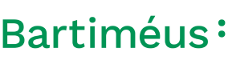

:::

# VIP-IT

Een toegankelijk IT-omscholingsprogramma met baangarantie voor mensen met een visuele beperking.
:::

:::

## Ons omscholingstraject

Tijdens het omscholingsprogramma bij VIP-IT school je je in 5 maanden om tot Software Engineer. Hierna ga je minimaal 6 maanden betaald aan de slag in je nieuwe functie bij één van de deelnemende werkgevers. Het omscholingsprogramma is toegankelijk gemaakt zodat jouw visuele beperking geen invloed heeft op het succesvol doorlopen van het omscholingstraject. Bij VIP-IT begeleiden we je het hele traject en kijken we waar maatwerk voor nodig is.

[Lees meer over ons omscholingsprogramma](over-ons)
:::

:::

## Doet u met ons mee?

Als deelnemer aan het pact vragen wij u om met ons mee te denken over en mee te werken aan het vormgeven van de aangepaste opleiding. Daarnaast vragen we u om uw invloed en netwerk in te zetten om werkgevers te enthousiasmeren mensen met een visuele beperking in hun organisatie op te nemen.

[Contact](/contact)
:::